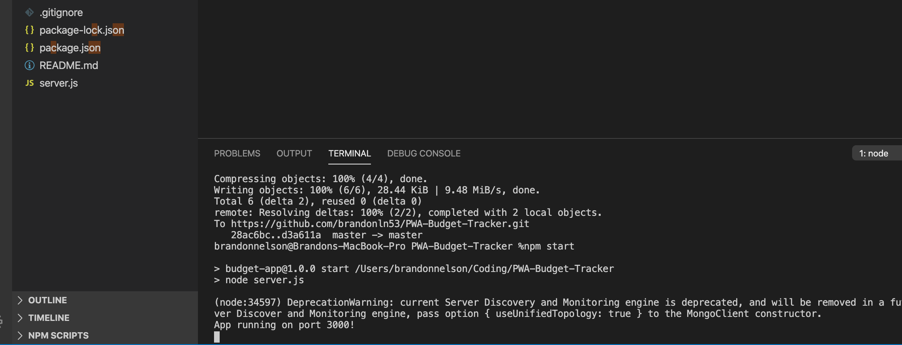
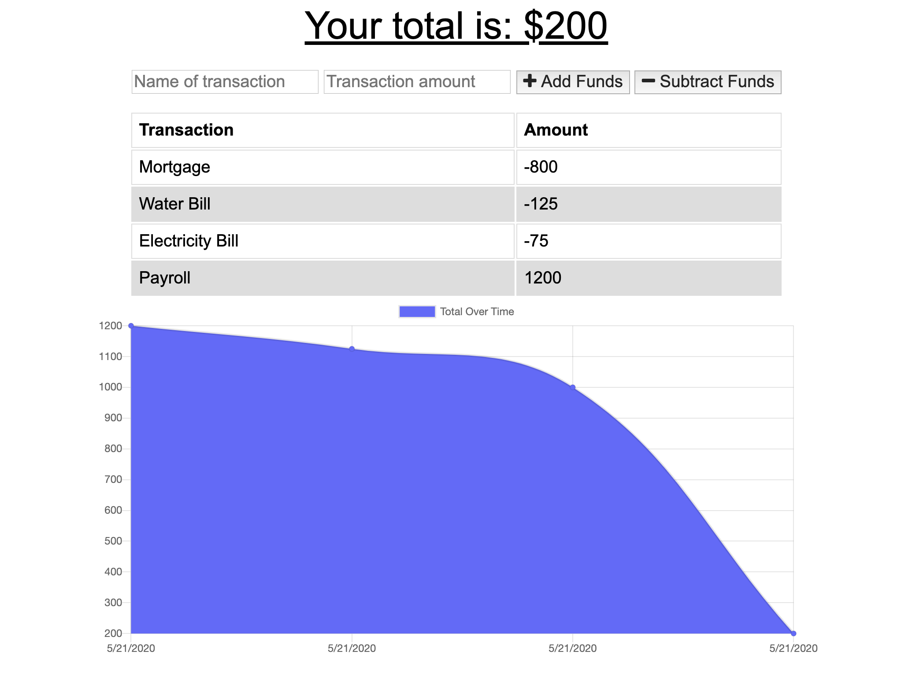
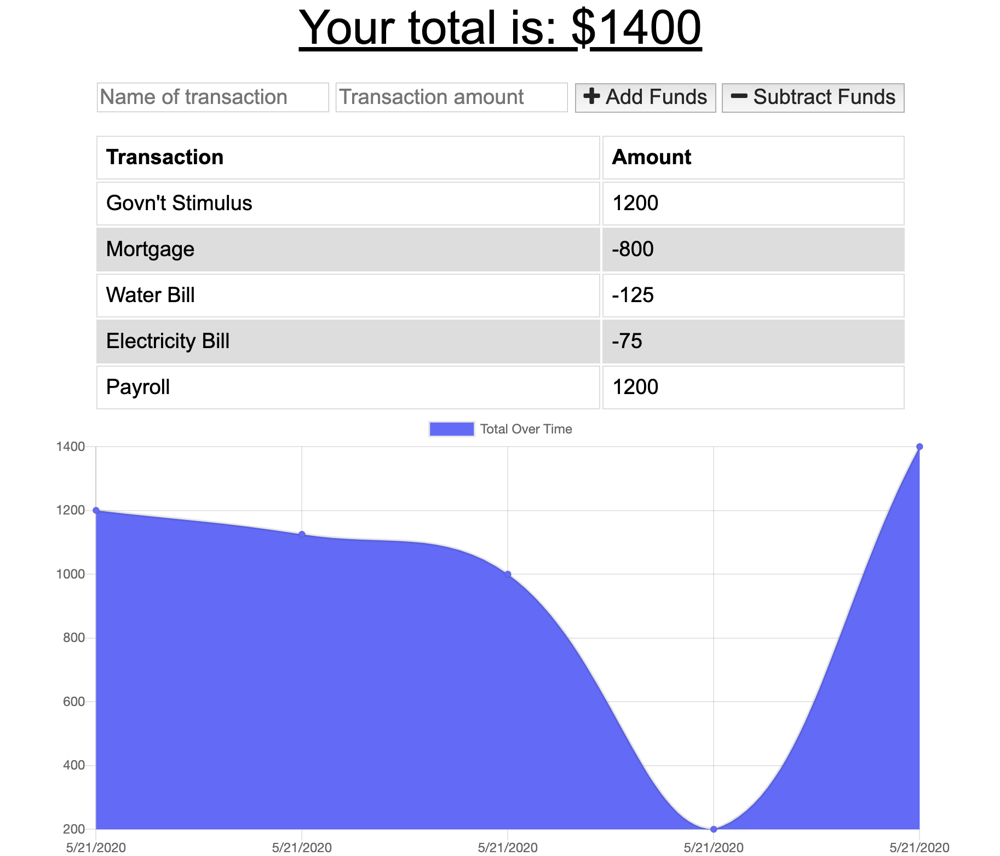

# Unit 17: PWA Budget-Tracker
This bootcamp homework focused on building a Progressive Web App that demonstrates the ability to store user information in an offline setting. The offline data will sync back to the app when the user is online again. This assignment allowed me to learn how I can bring a mobile app attributes to a web application.

## User Story
AS AN avid traveller
I WANT to be able to track my withdrawals and deposits with or without a data/internet connection
SO THAT my account balance is accurate when I am traveling.

## Business Context
Giving users a fast and easy way to track their money is important, but allowing them to access that information anytime is even more important. Having offline functionality is paramount to our applications success.

## GitHub Repository Link
https://github.com/brandonln53/PWA-Budget-Tracker

## Screenshots of the App

